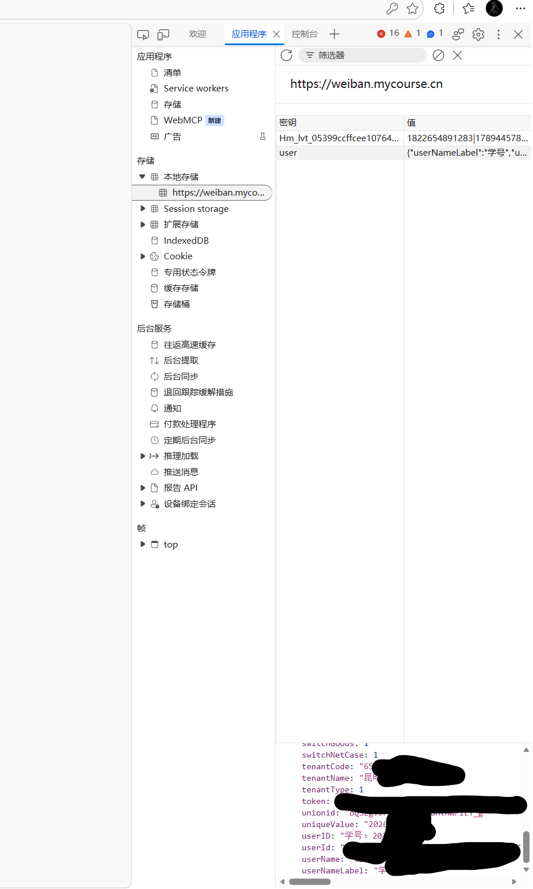

# _WeBan_ 安全微课 安全微伴 大学安全教育

# 此仓库为基于我个人使用的简单修改，如有需要请看上游仓库，谢谢

## 功能特性

- **课程学习**：自动遍历项目 → 分类 → 课程，模拟翻页、答题、等待学习时长后完课；按项目交替完成课程与考试
- **自动考试**：基于题库自动答题，支持单选/多选，未匹配题目可随机作答或手动输入
- **验证码识别**：登录滑块验证码自动识别；课程点选验证码自动识别（OpenCV，2 轮 × 3 次），失败才转手动
- **多账号并发**：支持配置多个账号，可多线程同时执行
- **题库同步**：考试前后自动从服务器同步题库，支持多用户共享
- **断点续考**：追求满分模式下，一次未满分可再次考试
- **进度监控**：完课后自动检查进度是否更新，未更新则警告提示
- **调试模式**：开启 `debug` 可查看完整请求/响应日志

## 使用

### 源码运行

克隆仓库

```bash
git clone --depth 1 https://github.com/hangone/WeBan
```

安装依赖

```bash
pip install -r requirements.txt # 或 uv sync
```

 运行

```bash
python main.py # 或 uv run main.py
```

运行 `python main.py --help` 可查看全部参数。

**填账号，开始**

第一次运行（或还没有配置文件时），程序会**直接让你输入学校、用户名、密码**（不用编辑任何文件）：

```
请输入账号信息：
  学校全称（如：XX大学）: XX大学
  用户名（学号/考生号之类的）: <你的账号>
  密码（默认同用户名）: <你的密码>
```

- ### Token 登录方法

有些从迎新系统跳转的可以试试账号密码都是学号，也可以尝试使用 Token 登录，在电脑浏览器登录后按 F12 或者 Ctrl+Shift+I 打开开发者工具，找到本地存储，复制 user 的内容到 config.toml 配置文件

[//]: 


输入后程序会**自动验证账号**：登录成功就会把账号自动保存到配置文件 `config.toml`，然后开始学习和考试；**如果学校全称或用户名密码错了，会提示你重新输入，不会写坏配置文件**。之后每次运行都会接着上次的进度继续。

### 参数总览

**每个配置项都有命令行参数和环境变量两种方式，三类名称一一对应**：配置文件键名（`snake_case`）= 命令行参数（`--kebab-case`）= 环境变量（`WB_SNAKE_CASE`），例如 `study_time` ↔ `--study-time` ↔ `WB_STUDY_TIME`。优先级均为 **命令行 > 环境变量 > 配置文件**：

| 配置文件键               | 参数                         | 环境变量                    | 说明                                                                               |
| ------------------------ | ---------------------------- | --------------------------- | ---------------------------------------------------------------------------------- |
| —                        | `--config PATH`              | `WB_CONFIG`                 | 配置文件路径（默认: 程序目录/config.toml）                                         |
| —                        | `--data-dir PATH`            | `WB_DATA_DIR`               | 数据目录（config/logs/answer 都在此，适合挂载）                                    |
| —                        | `--non-interactive`          | —                           | 无交互模式（环境变量用 `ENVIRONMENT=docker`/`container` 或 stdin 非 TTY 自动判定） |
| `study_mode`             | `--study-mode`               | `WB_STUDY_MODE`             | 学习模式（`false`/`true`/`force`）                                                 |
| `exam_mode`              | `--exam-mode`                | `WB_EXAM_MODE`              | 考试模式（`false`/`true`/`perfect`/`force`）                                       |
| `random_answer`          | `--random-answer`            | `WB_RANDOM_ANSWER`          | 题库外题目是否随机作答（`true`/`false`）                                           |
| `study_time`             | `--study-time SEC`           | `WB_STUDY_TIME`             | 每门课学习时长 `"基础,随机上限"`（秒），如 `"20,5"`                                |
| `video_speed`            | `--video-speed N`            | `WB_VIDEO_SPEED`            | 视频课程倍速：`0`=不按视频时长等待、`1`=原速、`2`=半速                             |
| `exam_question_time`     | `--exam-question-time SEC`   | `WB_EXAM_QUESTION_TIME`     | 每道考试题答题等待时长 `"基础,随机上限"`（秒）                                     |
| `exam_submit_match_rate` | `--exam-submit-match-rate N` | `WB_EXAM_SUBMIT_MATCH_RATE` | 允许交卷的最低题库匹配率（百分比）                                                 |
| `browser_path`           | `--browser-path PATH`        | `WB_BROWSER_PATH`           | 浏览器可执行文件路径                                                               |
| `cdp_host`               | `--cdp-host HOST`            | `WB_CDP_HOST`               | CDP 浏览器地址                                                                     |
| `cdp_port`               | `--cdp-port PORT`            | `WB_CDP_PORT`               | CDP 浏览器端口                                                                     |
| `jupiter_fallback`       | `--jupiter-fallback`         | `WB_JUPITER_FALLBACK`       | 对未加载 apicenext.js 的课程是否补发 jupiter 翻页轨迹                              |
| `max_workers`            | `--max-workers N`            | `WB_MAX_WORKERS`            | 多账号最大并发数                                                                   |
| `debug`                  | `--debug`                    | `WB_DEBUG`                  | 启用调试日志                                                                       |
| `tenant_name`            | `--tenant-name NAME`         | `WB_TENANT_NAME`            | 单账号学校全称（免配置文件）                                                       |
| `username`               | `--username USER`            | `WB_USERNAME`               | 单账号用户名                                                                       |
| `password`               | `--password PASS`            | `WB_PASSWORD`               | 单账号密码（默认同用户名）                                                         |
| `user_id`                | `--user-id ID`               | `WB_USER_ID`                | 单账号用户 ID（Token 登录）                                                        |
| `token`                  | `--token TOKEN`              | `WB_TOKEN`                  | 单账号登录 Token（配合 `--tenant-name --user-id`）                                 |
| `[ai].enable`            | `--ai-enable`                | `WB_AI_ENABLE`              | 是否启用 AI 搜题（`true`/`false`）                                                 |
| `[ai].base_url`          | `--ai-base-url URL`          | `WB_AI_BASE_URL`            | AI 服务 API 基础路径                                                               |
| `[ai].api_key`           | `--ai-api-key KEY`           | `WB_AI_API_KEY`             | AI 服务 API Key                                                                    |
| `[ai].model`             | `--ai-model NAME`            | `WB_AI_MODEL`               | AI 模型名称                                                                        |
| `[ai].timeout`           | `--ai-timeout SEC`           | `WB_AI_TIMEOUT`             | AI 请求超时秒数                                                                    |
| `[ai].max_retries`       | `--ai-max-retries N`         | `WB_AI_MAX_RETRIES`         | AI 请求失败最大重试次数                                                            |

无交互自动判定：`ENVIRONMENT=docker`（或 container）、stdin 非 TTY（cron/后台/管道）、或显式 `--non-interactive`。

**完全不写 config.toml 也能运行**（单账号 + 全部设置走 CLI/env）：

```bash
# 环境变量
WB_TENANT_NAME="你的学校全称" WB_USERNAME=你的学号 WB_PASSWORD=你的密码 \
WB_STUDY_TIME="20,5" WB_VIDEO_SPEED=0 ./WeBan-macos-arm64
# 或等价的命令行参数
./WeBan-macos-arm64 --tenant-name "你的学校全称" --username 你的学号 \
  --study-time "20,5" --video-speed 0
```

### 浏览器检测

程序按以下优先级自动检测可用的浏览器，无需手动配置：

1. **用户指定**：配置文件 `browser_path`（或 `--browser-path` / `WB_BROWSER_PATH`）
2. **CDP 远程调试**：配置文件 `cdp_host` + `cdp_port`（或 CLI/env），或 Docker 环境下自动尝试 `host.docker.internal:9222`
3. **Playwright 浏览器**：自动查找 `~/.cache/ms-playwright` 下的 Chromium
4. **系统浏览器**：自动查找已安装的 Chrome / Chromium / Edge

## 演示


## 常见问题

- ### 浏览器检测失败 / 启动失败

关闭代理软件的系统代理再试，或把 `127.0.0.1`、`localhost` 加入代理软件的 bypass 列表。


- ### 学习

1. 学习时长太低不会计入进度
2. 课程点选验证码会自动识别（无头浏览器 + OpenCV，最多 2 轮 × 3 次，可用 WB_CAPTCHA_ROUNDS/WB_CAPTCHA_ATTEMPTS 调整），失败后在交互模式会打开浏览器手动操作，无交互模式（Docker 等）会跳过该课程并告警
3. 学习进度不更新可能是被风控，遇到了需要验证码的课程，请去网页上完成一次后重试

- ### 考试

1. 考试前有腾讯无感验证码，自动处理（headless 浏览器）
2. 据观察，考试未提交是不会消耗考试次数的

## 鸣谢

- [https://github.com/Coaixy/weiban-tool](https://github.com/hangone/WeBan](https://github.com/hangone/WeBan)) 提供开源源码

## 其他

本项目仅供学习交流使用，请勿用于商业用途。
